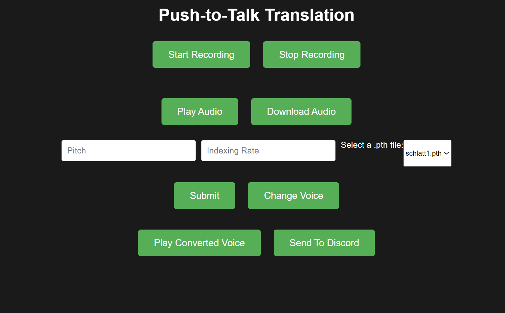

# Custom RVC WebUI
A website for push to talk ai conversion voices - can connect to Discord through VB virtual cable, or you can just download the .wav file yourself. Built with a server and client side.

## Installation
1. This requires two different folders all within one general directory. This provides the `push-to-talk` folder and every other file except the `hubert_base.py` which you must download and add to the `push-to-talk` folder. 

2. Make a secondary folder called `RVC-beta` and include the `RVC-beta0717` file, which can be found in the same location as the `hubert_base.py` [here](https://huggingface.co/lj1995/VoiceConversionWebUI/tree/main). Your resulting path should look like this: 
   

``` -Overall_directory
    -__pycache
    -recorded_audio
    -push-to-talk
      -hubert_base.py
    -RVC-beta
      -RVC-beta0717
    -requirements.txt
    -README.md
    -.gitignore
```

This is currently only tested on python version 3.11.4 on Windows, so make sure you have that version. Then, create a virtual environment and run `python -m venv venv`. Then run `. venv/Scripts/activate` to start the virtual environment.

Then, run `pip install -r requirements.txt`

Ensure that you have node installed as well. Then, inside the `push-to-talk` directory. Then, from the `push-to-talk` directory, run `node app.js`
  

## How to use:


This is how the website looks as of 11/7. When you want to record your own voice, click `Start Recording` to start and `Stop Recording` to stop. You'll know when you are recording because there will be a red dot indicating that it is recording.

`Play Audio` lets you listen to what you just recorded.

`Pitch` lets you change the pitch of the converted voice with ±8 being an octave, and negative values lowering the pitch and positive values increasing the pitch.

`Indexing Rate` is used to reduce the amount of timbre that is "leaked" from the training data. If index rate is set to 1, the timbre quality is more biased towards the training set (original voice)

the `.pth` dropdown will let you select a model that you have previously trained from in the `RVC-beta` folder. Note that it will be blank until you have trained a model.

`Submit` submits the preferences, and `Change Voice` starts the python file that actually converts the voice.

Once it is done converting, `Play Converted Voice` will allow you to play it out loud.

If you are trying to send it to Discord, `Send To Discord` will allow you to do that via virtual cable.

## If you would like to connect to Discord
- Install vb virtual cable 
- Set the default input device on windows to the Virtual cable
- Set the input device on Discord to the virtual cable


## General Notes
- This assumes the paths are correct and you have everything installed. In general, I've found that setting up machine learning environments as one of the hardest parts of this.
- You will have to train the models through the RVC provided training, through their own web ui in the `RVC-beta` folder. Use the `go-web` batch file to open up the website, and train ur model first.
- This assumes some general values for the translation - you can edit  them as needed, but would have to restart the website.
- Although I've squashed many bugs, this is not bug free. This website definitely assumes the best intention from it's users. 

## Known Bugs:
- Index Rate can't be anything besides 0. Unsure why this is, but for some reason in `vc_infer_pipeline.py` line 296, the big_npy array is empty, even though it should not be.